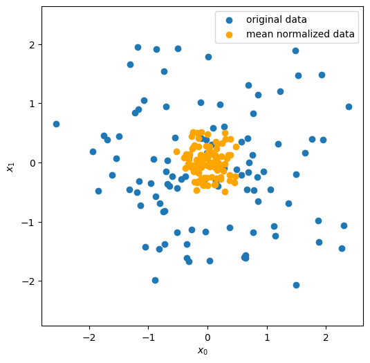
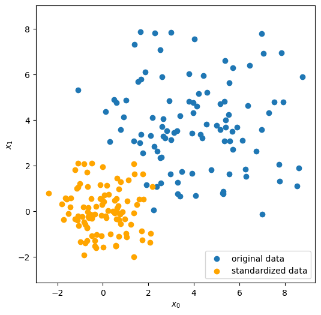
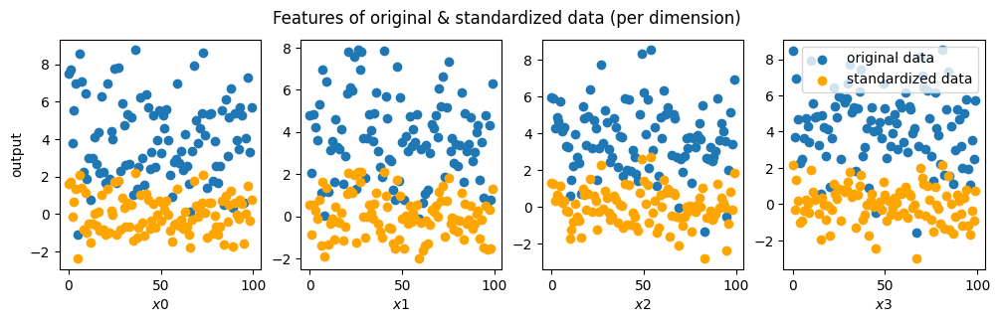
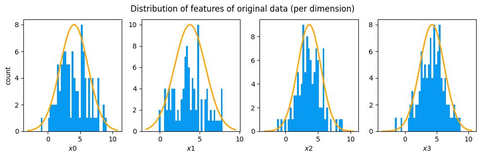
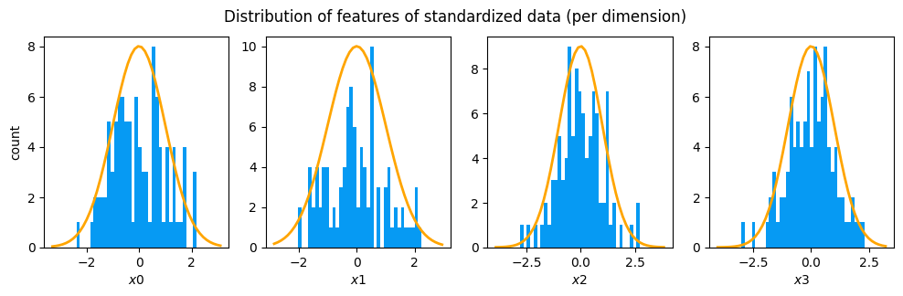

## Illustration of Concepts

During normalization procedure, subtracting the mean brings the datapoints to be centered around zero and reduces the mean to zero. In the context of deep learning, most activation functions have their strongest gradients around x = 0 and hence centering the datapoints in a dataset around zero would speed-up the learning.

### Mean Normalization

Mean normalization of N-dimensional dataset is implemented in the source code with insightful comments included as necessary. For simplicity, first two features (i.e. first two dimensions of the dataset) are scatter plotted to illustrate mean normalization.

### Standardization

Standardization of N-dimensional dataset is implemented in the source code with insightful comments included as necessary. For simplicity, first two features (i.e. first two dimensions of the dataset) are scatter plotted to illustrate standardization. Then, all the features containing 'N' datapoints (also known as training examples) in both original and standardized datasets are plotted for illustration. Lastly, the distribution of all features in both original and standardized datasets is illustrated.

## Citation

Please note that the code and technical details made available are for educational purposes only. The repo is not open for collaboration.

If you happen to use the code from this repo, please cite my user name along with link to my profile: https://github.com/balarcode. Thank you!
